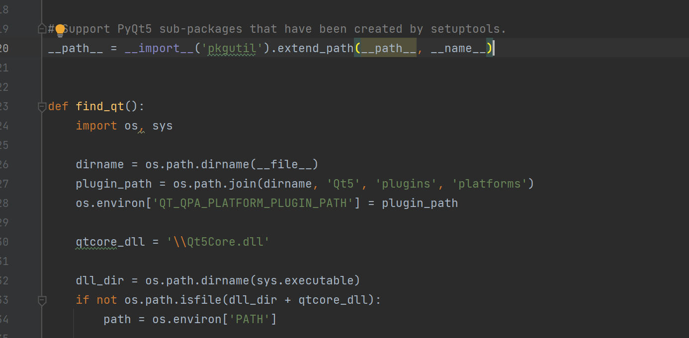

# Gnav
## Introduction

This project is aimed at modifying projects to use the `pyportable_installer` dependency for packaging our independently developed GNav software.

Advantages of `pyportable_installer`:

1. The packaged software can run without relying on a virtual environment.
2. After packaging the software, there is no need for a reinstallation; it can be used directly (but the entire folder must be retained).
3. The source code is encrypted after software packaging, enhancing security.

## Packaging Process

1. Install Python 3.9 (installation within a virtual environment is also acceptable).
2. Use `pip install pyportable-installer==4.4.2` to install the `pyportable-installer` dependency.
3. Check whether the CUDA version is 11.7:
   - Enter the command `nvcc -V` in the console to check the version.
   - If the version is incorrect, download and install CUDA 11.7 from the NVIDIA official website and switch to that version.
   - CUDA involves multiple packages, and adapting the packages to CUDA may require significant modifications. Future versions may support other CUDA versions.
4. Download `torch-2.0.0狭cp39-cp39-win_amd64.whl` from [https://download.pytorch.org/whl/torch](https://download.pytorch.org/whl/torch) (for Linux, download the corresponding version) and place it in the `dist/torch-package` directory.
   - This download provides the CUDA version of Torch, not the CPU version.
5. Open the console, navigate to the project folder (ensure it is in the same environment as Python 3.9).
6. While connected to the internet, run the command `python -m pyportable_installer build`.
   - Do not use a VPN.
   - After the command completes, the software package is generated in the `dist` folder.
7. Copy the DLLs and libs from `dist/add` to `dist/gnav-v0.1.0/venv`, copy `tkinter` to `dist/gnav-v0.1.0/venv/lib`, and copy the contents of `dist/add/tcl` to `dist/gnav-v0.1.0/venv/lib`.
8. Copy the `pyportable_runtime` from `dist/gnav-v0.1.0/lib` to `dist/gnav-v0.1.0/src/nnunet/inference`.
9. Open `dist/gnav-v0.1.0/venv/lib/site-packages/PyQt5/__init__.py` and add the following code:

```python
    dirname = os.path.dirname(__file__)
    plugin_path = os.path.join(dirname, 'Qt5', 'plugins', 'platforms')
    os.environ['QT_QPA_PLATFORM_PLUGIN_PATH'] = plugin_path
```



10. Double-click or run `dist/gnav-v0.1.0/GNav.exe` via the command line.
    - If running via the command line results in an error, it may be due to inconsistencies between the console's disk location and the file's disk location; switch to the same disk.
    - You can move the entire `dist/gnav-v0.1.0` folder to any location for execution.

The packaged folders are available on the Beihang Cloud, with both console and non-console versions. Contact the author for access.

